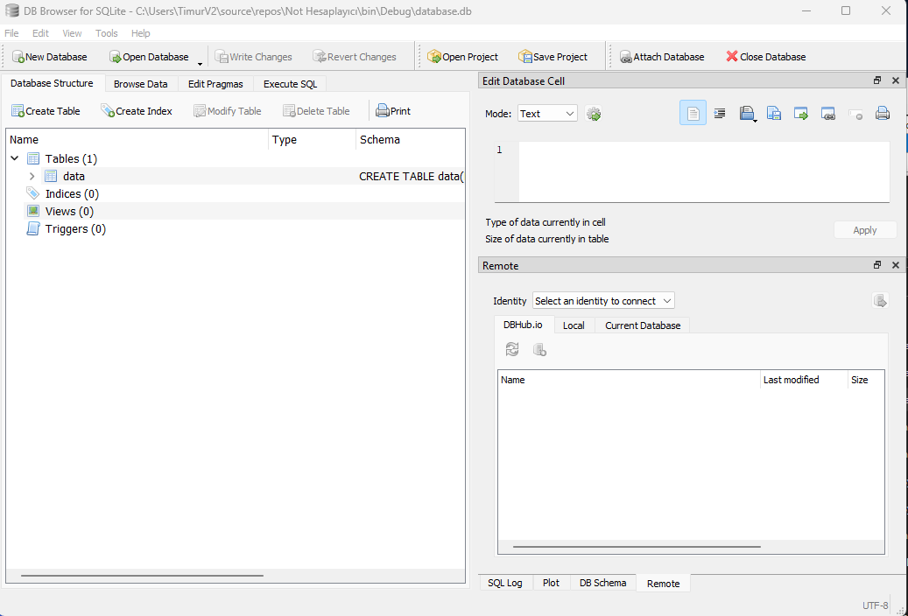

# Score Calculator V1.0.0

- [x] This is an app that calculates students exam scores and store them in an SQLite database.

- [x] It can calculate average score of all students and show you who got the highest score.

- [x] It is storing datas on database.db, and this file also can be opened and edited with SQLite DB Browser.
