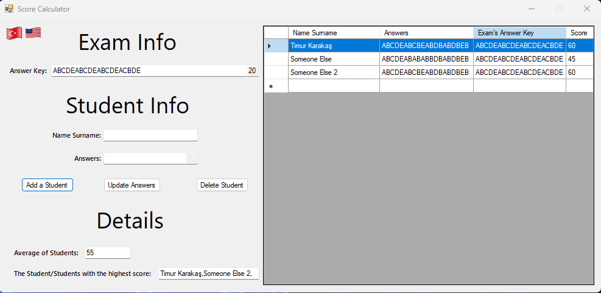

# Score Calculator V1.0.0

- [x] <b>This is an app that calculates students exam scores and store them in an SQLite database.</b>

- [x] <b>It can calculate average score of all students and show you who got the highest score.</b>

- [x] <b>It is storing datas on database.db, and this file also can be opened and edited with SQLite DB Browser.</b>
